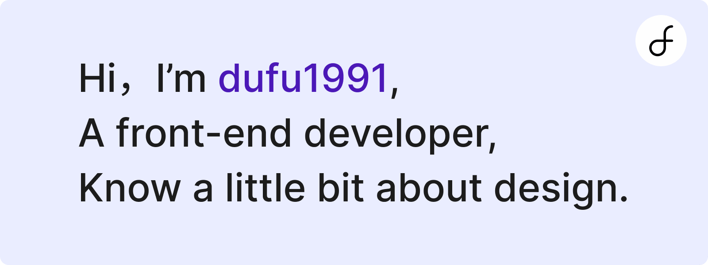

### About

  <a href="https://github.com/dufu1991">
    <picture>
      <source media="(prefers-color-scheme: dark)" srcset="./images/dufu-dark.png">
      
    </picture>
  </a>

### Stats

  <a href="https://github.com/dufu1991">
    <picture>
      <source media="(prefers-color-scheme: dark)" srcset="https://github-readme-stats-sigma-five.vercel.app/api?username=dufu1991&show_icons=true&theme=material-palenight&hide_border=true&bg_color=222638&hide=stars">
      
    </picture>
  </a>

### Languages

  <a href="https://github.com/dufu1991">
    <picture>
      <source media="(prefers-color-scheme: dark)" srcset="https://github-readme-stats-sigma-five.vercel.app/api/top-langs/?username=dufu1991&layout=compact&theme=material-palenight&hide_border=true&bg_color=222638">
      
    </picture>
  </a>

### Works

  <a href="https://stdf.design">
    <picture>
      <source media="(prefers-color-scheme: dark)" srcset="./images/stdf-dark.png">
      
    </picture>
  </a>

  <a href="https://simplecloudmusic.com">
    <picture>
      <source media="(prefers-color-scheme: dark)" srcset="./images/scm-dark.png">
      
    </picture>
  </a>

### Activities

  <a href="https://github.com/dufu1991">
    <picture>
      <source media="(prefers-color-scheme: dark)" srcset="https://github-readme-activity-graph.vercel.app/graph?username=dufu1991&theme=github&height=380&radius=16&hide_title=true&hide_border=true&bg_color=222638">
      
    </picture>
  </a>

### Skills

  

### Records

  <a href="https://github.com/dufu1991">
    <picture>
      <source media="(prefers-color-scheme: dark)" srcset="https://raw.githubusercontent.com/dufu1991/dufu1991/output/github-contribution-grid-snake-dark.svg">
      
    </picture>
  </a>

